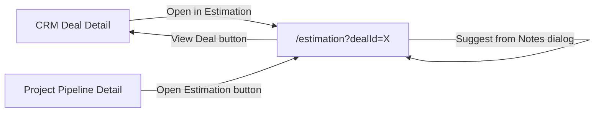
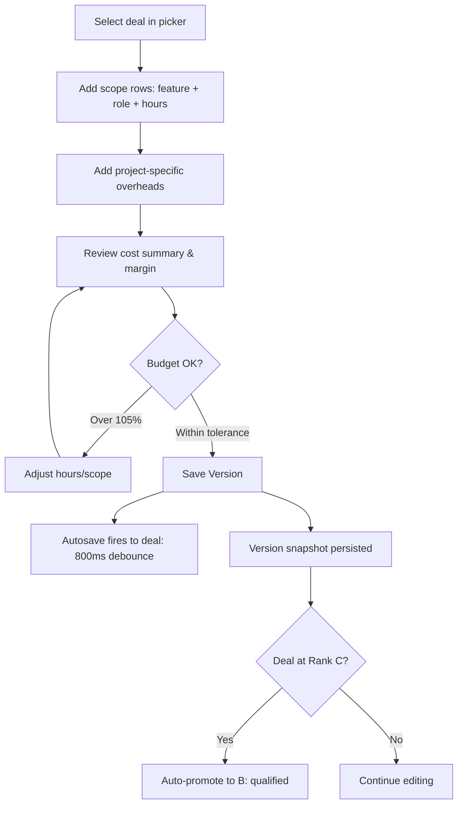
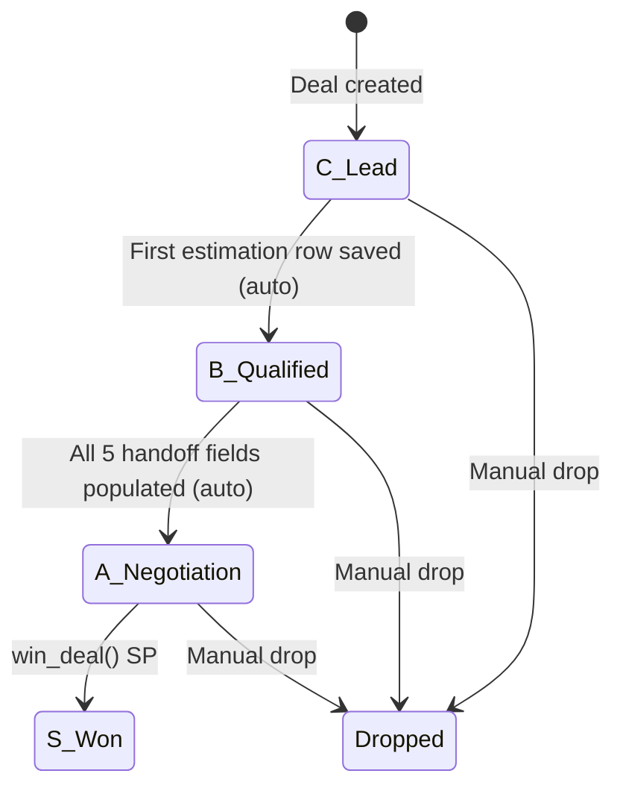
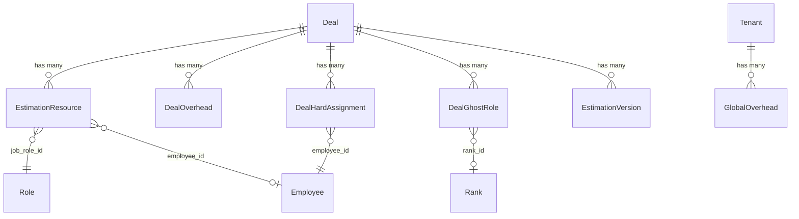

# Estimation Menu — Deep Dive

## Navigation and Menu Structure

The Estimation menu is a single-page application at `/estimation`, entered via the sidebar (`components/layout/Sidebar.tsx:38`) with a Calculator icon (orange). The sidebar link is hidden entirely for users without `manage_estimation` permission (`Sidebar.tsx:71` filters via `canAccessRoute()`). Edge middleware (`middleware.ts:7`) redirects unauthorized users before HTML ships.

The page accepts an optional `?dealId=` query parameter for deep-linking from CRM deal detail pages. When no `dealId` is provided, the user lands on an empty state with only the deal picker visible.

There is exactly one screen — no sub-routes, no tabs, no list view. All complexity is within the single `EstimationSimulator` component and its embedded dialogs.



## Per-Screen UI Inventory

### EstimationSimulator (`components/estimation/EstimationSimulator.tsx`, 1500 lines)

The component renders a 2-column grid (`lg:grid-cols-3`): left column spans 2, right column spans 1.

**Left column (top to bottom):**

1. **Target Deal Picker** (lines 721-746) — always visible. A `<Select>` dropdown populated from `store.deals` — all deals, unfiltered by status or rank. Each option shows `deal.name (deal.client || 'No client')`. Switching deals with unsaved changes prompts `window.confirm`. A "View Deal" button links to `/crm/{dealId}`.

2. **Estimate Versions Card** (lines 748-884) — visible only when a deal is selected. Shows current version number with a Draft/Saved chip (driven by signature comparison between local state and latest saved version). Contains:
   - **Version History Panel** (lines 805-872) — toggled by a button. Lists all versions with Compare, Export XLSX, and Restore buttons. Restore only appears for non-latest versions (idx > 0). Compare sets `compareWithId` which renders a `CompareBanner` showing a 3-column diff grid of hours and costs.
   - **Compare-To Dropdown** (lines 782-801) — select any saved version to compare against.

3. **AI Project Planner Card** (lines 886-1031) — visible only when a deal is selected. Contains a context-sensitive smart button that changes mode based on deal state:
   - `build` mode (no ghost roles exist): "Build AI Team & Estimate" — triggers `EstimationRoleBuilder` via imperative ref.
   - `scope` mode (roles exist, no scope rows): "Generate Scope from Deal" — calls `handleGenerateAi()`.
   - `notes` mode (both roles and scope exist): "Refine Scope from Notes" — opens `SuggestChangesFromNotesDialog`.
   - A secondary "Rebuild AI Team" button appears when rank is C or B, roles exist, and mode is not `build` (lines 974-991).
   - The `EstimationRoleBuilder` component is embedded here (lines 992-1026).

4. **Project Roles Table** (lines 1033-1084) — visible only when `deal.ghostRoles` has items. Read-only table showing roleType, quantity, months, salary range, and estimated cost per ghost role.

5. **Project Scope & Labor Table** (lines 1086-1163) — always rendered but dimmed (`opacity-50 pointer-events-none`) when no deal is selected. Contains:
   - `AIDraftReviewPanel` (lines 1091-1095) — violet banner shown when `aiDraft` is active, with confidence badge, feature/role counts, reasoning, and a Discard button.
   - Resource rows: Feature name, Role (display name from store), Sell Rate/Hr, Hours, Amount (hours x sell rate), delete button.
   - Add-row form at bottom: feature name input, role select, hours input, Add button.

6. **Project-Specific Overhead Table** (lines 1165-1213) — same dimming behavior. Overhead rows with name, cost, delete. Shows "No specific overheads" when empty.

**Right column:**

7. **Margin Summary Card** (lines 1217-1496) — dimmed when no deal. Contains:
   - Derived Margin percentage (large number display).
   - Financial breakdown: Labor (Sell), Labor Cost (Basis), Project Overhead, Total Project Cost, Expected Profit, Suggested Price.
   - Client Budget comparison line (conditional: `clientBudget > 0`, line 1273).
   - Budget overage warning (lines 1283-1293): rose-colored box when `suggestedPrice > clientBudget * 1.05` (5% tolerance, `BUDGET_TOLERANCE = 1.05` at line 710). Displays absolute overage and percentage.
   - Version notes textarea.
   - Save Version button (disabled when unchanged from saved or pending).
   - Auto-save explainer text.
   - Contract Ready section (lines 1327-1373): enabled "Mark Contract Ready" button when deal status is `qualified`; disabled with tooltip when `lead`; green "Contract Terms Confirmed" badge when `negotiation` or `won`.

**Loading/empty/error states:**
- No deal selected: scope table, overhead table, and margin card render dimmed and non-interactive. Version card and AI planner do not render.
- CompareBanner loading: italic "Loading..." text (line 122). Error: red text with "Retry" link (lines 125-130).
- Autosave failure: `toast.error`, `dirty` stays true so next edit re-triggers (line 331).
- AI generation failure: local state restored to pre-AI snapshot, `toast.error` (lines 459-467).

### Embedded Dialogs

**ContractReadyDialog** (`components/estimation/ContractReadyDialog.tsx`, 382 lines) — locks final commercial terms before handoff.

| Field | Type | Required | Validation (lines 124-153) |
|---|---|---|---|
| `monthlyFee` | number | Yes | Finite, > 0 |
| `contractMonths` | number | Yes | Integer >= 1 |
| `teamSummary` | textarea | Yes | Non-empty after trim |
| `currency` | text (3 chars) | Yes | Exactly 3 chars, uppercased |
| `installationFee` | number | No | Finite, >= 0 |
| `supportHours` | number (0-744) | No | Integer 0..744 |
| `otPolicy` | textarea | No | None |
| `templateVariant` | select | No | `cloud_backup`, `managed_hosting`, `engineer_dispatch` |

Defaults: `monthlyFee` is pre-computed as `suggestedPrice / defaultMonths` rounded to integer (line 94). `teamSummary` is auto-built from ghost roles or resource aggregation via `buildTeamSummary()` (lines 45-63). `currency` defaults from `useTenantCurrency()` (line 86).

On submit: writes 9 fields to the deal including `finalConfirmedAt: new Date().toISOString()` via `updateDeal.mutateAsync()` (lines 163-176). On success, fires `onConfirmed()` which the parent uses to open SendEstimateDialog. Error handling uses `normalizeError()` with 422 field-level error mapping via a hardcoded snake-to-camel `keyMap` (lines 188-197).

**SendEstimateDialog** (`components/estimation/SendEstimateDialog.tsx`, 154 lines) — emails the XLSX to the customer.

Two fields: `toEmail` (defaults to `deal.contactEmail`) and `message` (optional, max 2000 chars). Calls `POST /estimation-versions/{versionId}/send`. Shows an amber warning when `versionId` is null, telling the user to save a version first. No Zod validation — just non-empty check on email (line 65).

**SuggestChangesFromNotesDialog** (`components/estimation/SuggestChangesFromNotesDialog.tsx`, 519 lines) — AI delta flow.

Two phases:
- Phase 1: textarea for meeting notes (min 5 chars). "Suggest changes" button calls `POST /deals/{dealId}/estimation-versions/ai-delta` with current resources, overheads, and notes. Timeout: 210 seconds.
- Phase 2: diff review panel with DiffRow components (checkboxes for each add/remove/modify). Confidence badge (emerald/amber/rose). "Apply N changes & save version" button.

The `applyDelta()` function (lines 71-138) merges the delta:
1. **Remove**: builds case-insensitive `Set<string>` of feature/overhead names checked for removal. Filters out matching items.
2. **Modify**: builds `Map<string, number>` of new hours/costs for checked modifications. Maps over surviving items, replacing hours/cost where matched. Silent no-op if the target name doesn't exist.
3. **Add**: creates new items with `id: "ai-delta-" + crypto.randomUUID()`. Role lookup is case-insensitive title match via `rolesByTitle` map, falling back to the first role in the store (line 158).

On apply: fires `onApply({ resources, overheads, contextNotes })` which the parent uses to both update the deal and save a new version.

**AIDraftReviewPanel** (`components/estimation/AIDraftReviewPanel.tsx`, 57 lines) — read-only violet banner. Shows confidence badge, feature/role count from `draft.sheet2Features.length` and `draft.sheet5TeamStack.length`, reasoning text, and "Discard AI draft" button. No API calls, no local state.

**EstimationRoleBuilder** (`components/estimation/EstimationRoleBuilder.tsx`, 344 lines) — AI team composition via Claude (not Gemini despite docs).

Exposed via `useImperativeHandle` so parents can trigger `triggerBuild()` from their own button (line 167). Requires `clientBudget > 0 && timelineMonths > 0` to run (`canRun`, line 70).

Currency conversion: all monetary values converted to USD before sending to AI (`toUSD()` from `lib/currencyConverter.ts`), and converted back after response (`fromUSD()`). Exchange rates from `tenantStore.currentTenant.exchangeRates` (line 62).

Cost roll-up display (lines 283-305): Labor Cost (Basis) = `result.baseLaborCost`, Labor Sell = `baseLaborCost * 3`, Suggested Price = same as Labor Sell. Feasibility badge colored by `result.isFeasible`.

Calls `POST /api/ai-team-builder` (Next.js route handler, not Laravel). Loading animation cycles through 3 translated step messages every 1.1 seconds.

## Business Flows

### Flow 1: Manual Estimation (most common)



**Trigger**: user selects a deal and starts adding scope rows.

**Autosave** (`EstimationSimulator.tsx:304-343`): a `useEffect` watches `[dirty, resources, overheads, margin, selectedDealId]`. On change while `dirty === true`, schedules a save after 800ms of inactivity. Calls `PUT /deals/{id}` with `{ estimationResources, projectOverheads, targetMargin }`. Sets `dirty = false` on success.

**Save Version** (`handleSave`, `EstimationSimulator.tsx:494-556`): guarded by signature comparison — a string fingerprint of `margin + sorted resources + sorted overheads` (`localSignature`, lines 651-659) compared against the latest saved version's fingerprint (`savedSignature`, lines 661-670). Calls `POST /deals/{dealId}/estimation-versions`.

**Backend version persist** (`EstimationVersionController::store`, lines 76-178):
1. Computes next `version_number` as `max(version_number) + 1`.
2. Creates `estimation_versions` row with resources/overheads as JSONB.
3. Updates `deals.target_margin`.
4. Deletes all `estimation_resources` for the deal, re-inserts from payload (skipping sentinel rows via `isSentinelRow()`, line 62-74).
5. Deletes all `deal_overheads` for the deal, re-inserts.
6. Calls `deal->maybePromoteToQualified()` — auto-advances C to B if estimation rows now exist.
7. Generates XLSX via `EstimationXlsxService::generateAndStore()` (try/catch, non-blocking).

**Notable gap**: steps 3-7 are NOT wrapped in `DB::transaction()`. A failure midway leaves partial state. Compare with `DealController::update()` which correctly uses a transaction.

### Flow 2: AI Draft Generation

**Trigger**: user clicks "Generate Scope from Deal" (smart mode = `scope`).

1. Frontend calls `runAiGeneration()` (`EstimationSimulator.tsx:404`), which calls `POST /deals/{dealId}/estimation-versions/ai-draft`.
2. Backend `aiDraft()` (`EstimationVersionController.php:320-380`):
   - Sets `time_limit(0)`, `memory_limit=512M`, `ignore_user_abort(true)`.
   - Validates: deal must have `workload_description` OR a contract document with `analysis_status` in `['approved', 'pending']`. Returns 422 otherwise.
   - Calls `EstimationAiService::generateDraft($deal)`.
3. `EstimationAiService::generateDraft()` (`EstimationAiService.php:42-84`):
   - Calls `buildPrompt($deal)` which loads `resources/prompts/estimation_generation.txt` and substitutes 9 template variables.
   - Calls `callClaude()` with model `claude-3-5-sonnet-latest`, `max_tokens: 8192`, timeout 180s.
   - On JSON parse failure: retries once with a "Respond with valid JSON only" prefix.
   - Validates response shape via `validateShape()` (lines 318-344): checks 5 required top-level keys, function_id 1:1 match between sheet2 and sheet3, non-empty `role` on every manhours row.
   - Calls `suggestEmployees()` (lines 203-247): auto-populates `suggested_employee_id` on each manhours row by finding the most available employee per role via `mostAvailableEmployeeForRole()`.
4. Frontend receives the draft, sets `aiDraft` state, and populates `resources` and `overheads` from the draft's `sheet3_manhours` and `project_overheads`. Shows `AIDraftReviewPanel` banner.
5. User reviews/edits, then clicks Save Version to persist.

**The AI call is read-only** — it returns data but does not persist anything. The user must explicitly save.

### Flow 3: AI Delta from Meeting Notes

**Trigger**: user clicks "Refine Scope from Notes" (smart mode = `notes`), types meeting notes.

1. Frontend calls `POST /deals/{dealId}/estimation-versions/ai-delta` with `context_notes`, `current_resources`, `current_overheads`.
2. Backend `aiDelta()` (`EstimationVersionController.php:383-429`):
   - Validates `context_notes` (required, 5-20000 chars).
   - Calls `EstimationAiService::generateDelta()` which builds the delta prompt and calls Claude with `max_tokens: 4096`.
   - Returns structured diff: `{ resources: { add[], remove[], modify[] }, overheads: { add[], remove[], modify[] }, summary, confidence }`.
3. Frontend shows Phase 2 diff review. User checks/unchecks individual changes.
4. On "Apply N changes & save version": calls `applyDelta()` to merge, then fires `onApply()` which updates the deal AND saves a new version in one flow (`EstimationSimulator.tsx:1412-1442`).

### Flow 4: AI Team Building (Role Mode)

**Trigger**: user clicks "Build AI Team & Estimate" (smart mode = `build`).

1. `EstimationRoleBuilder` calls `POST /api/ai-team-builder` (Next.js route handler at `app/api/ai-team-builder/route.ts`).
2. Route handler:
   - Authenticates via `__session` cookie + `X-Tenant-ID` header. Checks permissions: only Admin, Sales, and super admins (line 219-262).
   - Uses `outputMode: 'roles'` which triggers `ROLE_SYSTEM_PROMPT` + `buildRoleUserPrompt()`.
   - Model: `claude-3-5-sonnet-latest`, temperature 0.2, max_tokens 4096.
   - Uses assistant prefill `{ role: 'assistant', content: '{' }` to force JSON.
   - On JSON parse failure: falls back to deterministic demo result.
3. Frontend receives `AISuggestedRole[]` with roleType, quantity, months, salary brackets.
4. User clicks "Accept Roles" → fires `onAccept(roles)` → parent writes `ghostRoles` to deal via `updateDeal.mutateAsync()`.

### Flow 5: Contract Ready Handoff

**Trigger**: user clicks "Mark Contract Ready" on a deal with status `qualified` (Rank B).

1. `ContractReadyDialog` opens with pre-computed defaults.
2. User fills/adjusts fields, clicks "Confirm / Lock Terms".
3. Writes 9 fields to deal via `PUT /deals/{id}`, including `finalConfirmedAt: now()`.
4. Backend `DealController::update()` (line 245-262): detects all `REQUIRED_ESTIMATION_FIELDS` are now populated. If deal is `qualified` and `canTransitionTo('negotiation')`: auto-advances to `negotiation` (Rank A), sets `win_probability` to 80.
5. On success, `onConfirmed()` fires → parent opens `SendEstimateDialog`.
6. User optionally sends XLSX to customer.

### Flow 6: Version Restore

**Trigger**: user clicks Restore on a non-latest version in the history panel.

1. `window.confirm` prompt (`EstimationSimulator.tsx:559`).
2. Calls `POST /estimation-versions/{id}/restore`.
3. Backend `restore()` (`EstimationVersionController.php:431-483`): overwrites live `estimation_resources` and `deal_overheads` from the version's JSONB snapshot. Updates `deals.target_margin`.
4. **Does NOT** call `maybePromoteToQualified()` or `syncHardAssignmentsFromEstimation()` — restoring a version does not trigger rank advancement or hard assignment sync.
5. Frontend refetches `['deals']` and `['estimation-versions']` queries, reloads local state from the refreshed deal.

### State Transitions (Deal Rank)



The C-to-B transition is triggered by `Deal::maybePromoteToQualified()` (`Deal.php:284-297`) when `hasStartedEstimation()` returns true (any `estimation_resources` or `deal_overheads` exist). Sets `win_probability` to 50.

The B-to-A transition is triggered inline in `DealController::update()` (lines 252-263) when `missingEstimationFields()` returns empty. The 5 required fields are: `final_monthly_fee`, `final_contract_months`, `final_team_summary`, `final_currency`, `final_confirmed_at`. Sets `win_probability` to 80.

### Cost Rate Resolution Chain

The cost for a scope row follows this resolution order (`EstimationSimulator.tsx:591-616`):

1. **Specific employee** (`costRateForResource`, line 604-612): if `res.employeeId` is set and that employee has a finite positive `costPerHour`, return `employee.costPerHour * 1.15`.
2. **Employee median for role** (`costRateForRole`, line 591-602): find all active employees with `jobRoleId === roleId` and positive `costPerHour`. If any, return `median(rates) * 1.15`.
3. **Role rate fallback**: if the role has a positive `rate`, return `role.rate * companySettings.costToBillRatio * 1.15`.
4. **Company default**: return `companySettings.fallbackHourlyCost * 1.15`.

The sell rate is always `costRate * 3` (`sellRateForResource`, line 616).

### Financial Roll-Up Formulas

All at `EstimationSimulator.tsx:621-640`:

```
laborCostBasis     = SUM(res.hours * costRateForResource(res))
laborSell          = SUM(res.hours * sellRateForResource(res))
projectOverheadTotal = SUM(overhead.cost)
totalCost          = laborCostBasis + projectOverheadTotal
suggestedPrice     = laborSell + projectOverheadTotal
expectedProfit     = suggestedPrice - totalCost
derivedMarginPct   = round((expectedProfit / suggestedPrice) * 100)
```

Constants from `lib/calculations.ts:5-28`:
- `LABOR_OVERHEAD_PERCENTAGE = 15` → `SELL_PRICE_MULTIPLIER = 1.15`
- `BILLING_MARKUP_MULTIPLIER = 3`
- Effective markup: raw cost x 1.15 x 3 = raw cost x 3.45

Budget overage (`EstimationSimulator.tsx:710-715`):
```
BUDGET_TOLERANCE    = 1.05
exceedsBudget       = clientBudget > 0 && suggestedPrice > clientBudget * 1.05
budgetOverage       = suggestedPrice - clientBudget    // absolute, not vs tolerance
budgetOveragePercent = (budgetOverage / clientBudget) * 100
```

## Data Model and Data Flow



### Core Entities

**Deal** (`app/Models/Deal.php`, 415 lines) — the parent entity. Contains 20+ estimation-relevant scalar fields: cost/pricing (`target_margin`, `base_labor_cost`, `overhead_cost`, `buffer_cost`, `total_estimated_cost`, `estimated_gross_profit`, `client_budget`), timeline (`timeline_months`, `workload_hours`), OT policy (`ot_policy_model`, `ot_rate_per_hour`, `ot_included_hours_per_month`, `ot_notes`), handoff fields (`final_monthly_fee`, `final_installation_fee`, `final_contract_months`, `final_ot_policy`, `final_support_hours_per_month`, `final_team_summary`, `final_currency`, `final_confirmed_at`, `suggested_template_variant`).

**EstimationResource** (`app/Models/EstimationResource.php`, 44 lines) — scope line items. Fields: `deal_id`, `job_role_id`, `role_id`, `employee_id`, `feature_name`, `hours`. Two role columns exist: `job_role_id` (used by Eloquent `role()` relationship) and `role_id` (exposed in API responses). Rows are deleted and re-inserted as a complete set on every save.

**EstimationVersion** (`app/Models/EstimationVersion.php`, 44 lines) — immutable snapshots. Fields: `deal_id`, `version_number`, `resources` (JSONB), `overheads` (JSONB), `target_margin`, `notes`, `context_notes`, `created_by`, `xlsx_path`, `sent_at`, `sent_to_email`. Timestamps disabled (`$timestamps = false`). The JSONB arrays preserve AI sentinel rows (`_sheet1_summary`, `_sheet5_team_stack`) that the relational sync filters out.

**DealGhostRole** (`app/Models/DealGhostRole.php`, 46 lines) — AI team composition. Fields: `deal_id`, `role_type` (frontend|backend|pm|qa|design), `quantity`, `months`, `avg_monthly_salary`, `min_monthly_salary`, `max_monthly_salary`, `rank_id`. The `rank_id` field and `rank()` relationship exist on the backend but are invisible to the frontend (not exposed in DealResource, not in the TS type).

**DealOverhead** (`app/Models/DealOverhead.php`, 30 lines) — project-specific costs. Fields: `deal_id`, `name`, `cost`. Named `deal_overheads` in the backend but mapped to `projectOverheads` in the frontend.

**DealHardAssignment** (`app/Models/DealHardAssignment.php`, 37 lines) — concrete employee-to-deal mappings. Fields: `deal_id`, `employee_id`, `allocated_hours`. Derived from estimation data via `syncHardAssignmentsFromEstimation()` — aggregates estimation_resources by employee_id.

**GlobalOverhead** (`app/Models/GlobalOverhead.php`, 35 lines) — tenant-level overhead items. Fields: `tenant_id`, `category`, `description`, `monthly_cost`, `effective_month`, `effective_year`. Period-scoped: NULL month/year means "always". Uniqueness is compound: `(tenant_id, category, effective_month, effective_year)`.

### Every Read

| Endpoint | Entities/Fields | Filters/Scoping | Consumer |
|---|---|---|---|
| `GET /deals` | Deal + ghost_roles, hard_assignments, estimation_resources, deal_overheads (whenLoaded) | BelongsToTenant | Deal picker, Zustand store |
| `GET /deals/{deal}` | Same | BelongsToTenant + route model binding | Deal detail, store refresh |
| `GET /deals/{deal}/estimation-versions` | EstimationVersion (summary fields) | BelongsToTenant, ordered by version_number DESC | Version history panel |
| `GET /estimation-versions/{id}` | EstimationVersion (full JSONB) | BelongsToTenant | Version comparison, signature check |
| `GET /estimation-versions/{id}/download/xlsx` | EstimationVersion → XLSX file | BelongsToTenant | Download button |
| `GET /global-overheads` | GlobalOverhead | BelongsToTenant, ordered by created_at | AI team builder context |
| `GET /deals/{deal}/ai-team-builder-context` | Employees + ranks + past projects | BelongsToTenant, excludes Cancelled/Not Started projects | AI team builder |

### Every Write

| Endpoint | Entities Written | Trigger |
|---|---|---|
| `PUT /deals/{deal}` | Deal scalars, estimation_resources (delete-all + re-insert), deal_overheads (same), deal_ghost_roles (same), deal_hard_assignments (same) | Autosave (800ms debounce), AI role accept, contract ready, suggest-from-notes apply |
| `POST /deals/{deal}/estimation-versions` | estimation_versions (insert), estimation_resources (delete-all + re-insert), deal_overheads (same), deals.target_margin | Save Version button |
| `POST /estimation-versions/{id}/restore` | estimation_resources (delete-all + re-insert from JSONB), deal_overheads (same), deals.target_margin | Restore button |
| `POST /estimation-versions/{id}/send` | estimation_versions.sent_at, estimation_versions.sent_to_email | Send Estimate dialog |
| `POST /global-overheads` | global_overheads (insert) | Organization page (not estimation UI) |

### Dual Persistence Pattern

EstimationVersionController::store() maintains two parallel representations:
1. **JSONB snapshot** in `estimation_versions.resources`/`.overheads` — preserves AI sentinel rows, used for version history and restore.
2. **Relational rows** in `estimation_resources`/`deal_overheads` — filtered (no sentinels), used for live editing, cost calculations, and `syncHardAssignmentsFromEstimation()`.

The two can diverge if the relational sync fails partway (no transaction boundary — see Invariants section).

### Data That Flows Out

- **To CRM Kanban** (`components/crm/KanbanBoard.tsx:186-189`): `getDealEstimation(deal.id)` renders gross profit and estimated cost on deal cards.
- **To Project Pipeline** (`app/(dashboard)/project-pipeline/[id]/page.tsx:106-182`): computes `estimationRollup` from `deal.estimationResources`, displays KPI cards.
- **To Contract Drafting** (`ContractDraftService`): validates estimation handoff completeness, reads `final_ot_policy` for overtime clause generation.
- **To win_deal() SP**: `deal_hard_assignments` → `project_team_assignments`. `client_budget` → `contracts.total_value`. `workload_hours` → `projects.budget_hours`.
- **XLSX migration** (`EstimationXlsxService::migrateToProject()`, lines 158-200): moves XLSX files from `deals/{deal_id}/` to `projects/{project_number}/` path after a deal is won.

## AI Generation Surface

### 1. Estimation Draft Generation (Claude)

**Location**: `app/Services/EstimationAiService.php:42-84` (backend), `lib/queries/estimationVersions.ts:161-296` (frontend hook)

**Purpose**: generate a complete first-draft estimation from a deal's workload description and/or attached contract documents.

**Model**: `claude-3-5-sonnet-latest` (`EstimationAiService.php:30`)

**API parameters**: `max_tokens: 8192`, no temperature set (Anthropic default), timeout 180s, connect timeout 15s. Single `user` message, no `system` message.

**Full prompt template** (`resources/prompts/estimation_generation.txt`):

```
You are an experienced delivery estimator for a software agency. From the deal context
below, produce a structured first-draft estimation that fills the agency's standard
5-sheet Excel template. Match the agency's existing style as shown in the past-deal
examples (granularity, role mix, phase split).

# Output format
Respond with EXACTLY one JSON object, no markdown fences, no preface, no trailing
prose. Schema:

{
  "sheet1_summary": {
    "rough_estimate_hours": number,
    "requirement_study_hours": number,
    "web_development_hours": number,
    "environment_setup_hours": number,
    "total_hours_per_person": number,
    "total_days_per_person": number,
    "total_months_per_person": number
  },
  "sheet2_features": [
    { "function_id": "F001", "name": string, "explanation": string,
      "category": "Web" | "Mobile" | "Integration" | "Infrastructure" }
  ],
  "sheet3_manhours": [
    { "function_id": "F001", "dev_hours": number, "role": string }
  ],
  "sheet4_milestone": {
    "start_month": "YYYY-MM",
    "total_months": number,
    "phase_durations": {
      "requirements": number, "architecture": number, "basic_design": number,
      "server_setup": number, "implementation_web": number,
      "implementation_android": number, "test_data": number, "unit_test": number,
      "integration_test": number, "system_test": number, "manual": number
    }
  },
  "sheet5_team_stack": [
    { "role": string, "count": integer,
      "monthly_allocation": [number, number, ...] }
  ],
  "project_overheads": [
    { "name": string, "cost": number, "reason": string }
  ],
  "reasoning": string,
  "confidence": "high" | "medium" | "low"
}

# Rules
1. Use function_id format F001, F002, F003... in insertion order.
2. sheet2_features[i].function_id and sheet3_manhours[i].function_id MUST match 1:1.
3. Only propose dev_hours per feature in sheet3 — do NOT compute downstream phase
   costs. Those are derived by the spreadsheet via fixed multipliers.
4. sheet5_team_stack[*].monthly_allocation.length MUST equal
   sheet4_milestone.total_months. Use values in [0.0, 1.0].
5. Use role names exactly as they appear in the {{ORG_ROLES_BLOCK}} below.
5a. Each sheet3_manhours row MUST carry a `role` field naming the role that will do
    the work. Match a role title from {{ORG_ROLES_BLOCK}} verbatim. Do NOT default
    everything to a single role. Account Director / Finance Manager rarely build
    features; reserve those for management/finance-flavoured work only.
6. Categories must be one of: "Web", "Mobile", "Integration", "Infrastructure".
7. Round dev_hours to whole numbers when >= 4, to one decimal otherwise.
8. Aim for 10-40 features.
9. Set confidence to "high" if a contract document is provided AND past won deals
   match this scope, "medium" if only one of those holds, "low" otherwise.
10. project_overheads — predict project-specific overhead line items. Each entry is a
    one-time or recurring expense the agency would incur DELIVERING this specific
    deal. Examples: travel, specialized licenses, compliance/audits,
    translation/localisation, third-party APIs, cloud infrastructure, hardware.
    Costs are TOTAL project costs. Include a short `reason` per item. Output 0-6 items.

# Deal context
Client: {{CLIENT_NAME}}
Workload description:
{{WORKLOAD_DESCRIPTION}}
Client budget: {{CLIENT_BUDGET}}
Timeline (months): {{TIMELINE_MONTHS}}
Target margin: {{TARGET_MARGIN}}
Expected close: {{EXPECTED_CLOSE_DATE}}

# Contract documents
{{CONTRACT_DOCUMENTS_BLOCK}}

# Organization roles (use these names exactly in sheet5_team_stack)
{{ORG_ROLES_BLOCK}}

# Past won deals (style reference)
{{FEW_SHOT_DEALS_BLOCK}}
```

**Variable bindings**:

| Variable | Source | Population method |
|---|---|---|
| `{{CLIENT_NAME}}` | `$deal->client` | Direct field, falls back to `'(unknown)'` |
| `{{WORKLOAD_DESCRIPTION}}` | `$deal->workload_description` | Direct field, falls back to `'(none provided)'` |
| `{{CLIENT_BUDGET}}` | `$deal->client_budget` | Cast to string, falls back to `'(unknown)'` |
| `{{TIMELINE_MONTHS}}` | `$deal->timeline_months` | Cast to string, falls back to `'(unknown)'` |
| `{{TARGET_MARGIN}}` | `$deal->target_margin` | Appends `'%'`, falls back to `'(not set)'` |
| `{{EXPECTED_CLOSE_DATE}}` | `$deal->expected_close_date` | Direct field, falls back to `'(unset)'` |
| `{{CONTRACT_DOCUMENTS_BLOCK}}` | `DealContractDocument` records | `buildContractDocsBlock()` (lines 368-411): queries documents with `analysis_status` in `['approved', 'pending']`, extracts text via `ContractAnalysisService::extractText()` (private method accessed via reflection), concatenates up to 50,000 chars with `## filename` headers |
| `{{ORG_ROLES_BLOCK}}` | `Role` model | `buildRolesBlock()` (lines 413-431): lists all tenant roles as `- Title (department) — billable rate X/hr` |
| `{{FEW_SHOT_DEALS_BLOCK}}` | 3 most recent won deals | `buildFewShotBlock()` (lines 434-477): finds 3 most recent won deals (excluding current), loads latest EstimationVersion per deal, lists up to 20 feature rows with names and hours. Returns `"(insufficient won-deal history — skipped)"` if fewer than 2 past deals exist |

**Output drives downstream**: the 5-sheet JSON is returned to the frontend, which populates local `resources` and `overheads` state. The user reviews, edits, and saves as a version. The JSONB snapshot preserves AI sentinel rows (`_sheet1_summary`, `_sheet5_team_stack`) which the XLSX generator reads.

**Post-processing**: `validateShape()` (lines 318-344) checks 5 required keys + function_id 1:1 matching + non-empty role fields. `suggestEmployees()` (lines 203-247) auto-populates `suggested_employee_id` per manhours row via `mostAvailableEmployeeForRole()` (lines 255-310) — fuzzy role title matching, availability = `workable_hours - committed - logged`, returns null for negative availability.

**Fallback on failure**: single retry with "Respond with valid JSON only" prefix on JSON-shape failures (`"returned non-JSON"`, `"missing key:"`, `"function_ids do not match"`, `"is missing a role field"`). Transport failures are not retried. On final failure: 503 response (non-production includes error detail).

**Usage logging**: `logUsage()` (lines 479-497) creates `AiUsageLog` record with feature label `'estimation_generation'`, model name, input/output tokens, and estimated cost at $3/M input + $15/M output.

### 2. Estimation Delta Suggestion (Claude)

**Location**: `app/Services/EstimationAiService.php:95-136` (backend), `lib/queries/estimationVersions.ts:316-410` (frontend hook)

**Purpose**: suggest structured scope changes (add/remove/modify) based on customer meeting notes.

**Model**: `claude-3-5-sonnet-latest`, `max_tokens: 4096` (half of draft)

**Full prompt template** (`resources/prompts/estimation_delta.txt`):

```
You are an experienced delivery estimator helping an agency adjust an estimation
based on the latest customer conversation.

You will receive THREE inputs:
1. The CURRENT estimation — feature scope rows + project overheads.
2. The CUSTOMER MEETING NOTES — free-form text describing what the customer said.
3. Deal context — client name, budget, currency hints.

Your job: identify ONLY the changes the meeting notes actually justify. Do NOT
re-write the whole estimate. Do NOT add filler rows. Be conservative.

# Output format
Respond with EXACTLY one JSON object. Schema:

{
  "resources": {
    "add":    [{ "feature_name": string, "role": string, "hours": number,
                 "reason": string }],
    "remove": [{ "feature_name": string, "reason": string }],
    "modify": [{ "feature_name": string, "new_hours": number,
                 "reason": string }]
  },
  "overheads": {
    "add":    [{ "name": string, "cost": number, "reason": string }],
    "remove": [{ "name": string, "reason": string }],
    "modify": [{ "name": string, "new_cost": number, "reason": string }]
  },
  "summary": string,
  "confidence": "high" | "medium" | "low"
}

# Rules
1. `remove` and `modify` MUST reference a feature_name/name that exists VERBATIM
   in the CURRENT estimation. If not present, ignore it.
2. `add` rows must NOT already exist. If expanding existing scope, prefer `modify`.
3. `role` for added rows MUST come verbatim from {{ORG_ROLES_BLOCK}}.
4. Round hours to whole numbers when >= 4, one decimal otherwise. cost is whole-number.
5. `reason` is REQUIRED — must quote or paraphrase the specific meeting notes bit.
6. `summary` is one paragraph (<= 60 words).
7. `confidence`: "high" only when notes are explicit. "low" when inferring intent.
8. If notes are too vague, return all arrays empty and explain in summary.
9. Total add+remove+modify entries MUST NOT exceed 20.

# Inputs

## Deal context
Client: {{CLIENT_NAME}}
Client budget: {{CLIENT_BUDGET}}
Currency: {{CURRENCY}}

## Current estimation
### Scope rows
{{CURRENT_RESOURCES_BLOCK}}
### Overheads
{{CURRENT_OVERHEADS_BLOCK}}

## Customer meeting notes
{{CONTEXT_NOTES}}

## Organization roles
{{ORG_ROLES_BLOCK}}
```

**Variable bindings**:

| Variable | Source |
|---|---|
| `{{CLIENT_NAME}}` | `$deal->client` |
| `{{CLIENT_BUDGET}}` | `$deal->client_budget` |
| `{{CURRENCY}}` | `$deal->final_currency` |
| `{{CURRENT_RESOURCES_BLOCK}}` | `formatResourcesForPrompt()` (lines 580-594): each resource as `- "feature_name" — role: X, hours: Y` |
| `{{CURRENT_OVERHEADS_BLOCK}}` | `formatOverheadsForPrompt()` (lines 596-608): each overhead as `- "name" — cost: X` |
| `{{CONTEXT_NOTES}}` | Trimmed meeting notes from user input, or `'(empty)'` |
| `{{ORG_ROLES_BLOCK}}` | Same as draft: all tenant roles as `- Title (department) — billable rate X/hr` |

**Post-processing**: `validateDeltaShape()` (lines 617-637) checks top-level keys `resources`, `overheads`, `summary`, `confidence` and that `resources`/`overheads` each contain `add`, `remove`, `modify` arrays. No `suggestEmployees()` on delta.

**Fallback**: same retry pattern as draft. Feature label: `'estimation_delta'`.

### 3. AI Team Builder (Claude via Next.js route)

**Location**: `app/api/ai-team-builder/route.ts` (Next.js route handler), `components/estimation/EstimationRoleBuilder.tsx` (frontend), `lib/aiTeamBuilder.ts` (prompts)

**Purpose**: suggest team composition (role buckets with quantities and salary brackets) from deal parameters.

**Model**: `claude-3-5-sonnet-latest` (NOT Gemini despite CLAUDE.md docs), temperature 0.2, max_tokens 4096.

**Authentication**: validates `__session` cookie + `X-Tenant-ID` header. Calls `GET /api/auth/me` to verify. Restricted to Admin, Sales, and super admins.

**Uses assistant prefill**: `{ role: 'assistant', content: '{' }` to force JSON output.

**Two modes** (estimation uses `roles` mode):
- `roles` mode: `ROLE_SYSTEM_PROMPT` + `buildRoleUserPrompt()`. Suggests 5 fixed role buckets (frontend, backend, design, qa, pm) with quantities, months, and salary ranges. `team[]` is empty.
- `people` mode (used by CRM staffing, not estimation): `SYSTEM_PROMPT` + `buildUserPrompt()`. Picks specific employees. Post-processed by `enforceSkillCoverage()`.

**Prompts**: defined in `lib/aiTeamBuilder.ts`. `ROLE_SYSTEM_PROMPT` (~100 lines) covers the 5 role buckets, team shape by complexity band (easy: 2, medium: 3-4, hard: 5-7), pricing model (loaded cost x 1.15, sell x 3), and full JSON output schema with `roles[]`. `buildRoleUserPrompt()` constructs a user message with project brief + engineer salary brackets + pricing model.

**Currency handling**: all monetary values converted to USD before sending (`toUSD()`), converted back after response (`fromUSD()`). Exchange rates from `tenantStore.currentTenant.exchangeRates` (`EstimationRoleBuilder.tsx:62`).

**Fallback on failure**: JSON parse failure or API error falls back to deterministic `generateRoleDemoResult()` based on keyword matching (returns 200, not 500). Empty AI response returns 500.

**Usage logging**: fire-and-forget POST to `/api/ai-usage` with same $3/$15 pricing.

## External Integrations

| Service | What It Does | When | Failure Behavior |
|---|---|---|---|
| **Anthropic Claude API** (`claude-3-5-sonnet-latest`) | Draft generation, delta suggestion, team building | User-triggered AI buttons | Single retry on JSON-shape errors; 503 to frontend; team builder falls back to demo result |
| **Mailgun** (via Laravel mail) | Sends estimation XLSX to customer | Send Estimate dialog | Queued via `Mail::queue()`. Failure logged, 503 response |
| **Local disk storage** | Stores generated XLSX files | On version save (non-blocking) and on-demand download | Lazy regeneration if file missing; 503 if regeneration fails |

No webhooks, payment providers, or other external services are touched by the estimation menu.

## Permissions and Access

### Frontend Gating

| Layer | Check | Permission | Effect |
|---|---|---|---|
| Edge middleware (`middleware.ts:7,70-75`) | `canAccessRoute(user, '/estimation')` | `manage_estimation` | Redirect before HTML ships |
| Sidebar (`Sidebar.tsx:71`) | `canAccessRoute(user, '/estimation')` | `manage_estimation` | Link hidden entirely |
| Page components | None | — | No `PermissionGuard` wrappers used anywhere in estimation components |

### Backend Gating

| Route | Permission | Lines |
|---|---|---|
| `GET /deals/{deal}/estimation-versions` | `view_crm` | `api.php:132-133` |
| `GET /estimation-versions/{id}` | `view_crm` | `api.php:134` |
| `GET /estimation-versions/{id}/download/xlsx` | `view_crm` | `api.php:135` |
| `POST /deals/{deal}/estimation-versions` | `manage_crm` | `api.php:137-138` |
| `POST /deals/{deal}/estimation-versions/ai-draft` | `manage_crm` | `api.php:139` |
| `POST /deals/{deal}/estimation-versions/ai-delta` | `manage_crm` | `api.php:140` |
| `POST /estimation-versions/{id}/restore` | `manage_crm` | `api.php:141` |
| `POST /estimation-versions/{id}/send` | `manage_crm` | `api.php:143` |
| `GET /global-overheads` | `manage_organization\|manage_estimation\|view_crm` | `api.php:259` |
| `PUT /deals/{deal}` | `manage_crm` | `api.php:73` |
| `POST /api/ai-team-builder` | Admin or Sales role (hardcoded check) | `route.ts:219-262` |

### Permission Mismatch

**The frontend gates on `manage_estimation` but all backend estimation APIs gate on `view_crm` / `manage_crm`.** This creates two problems for custom roles:

1. A role with `manage_estimation` but without `view_crm`/`manage_crm` can see the page but every API call returns 403.
2. A role with `manage_crm` but without `manage_estimation` can call all estimation APIs via curl but cannot see the page.

This works correctly for the default "Sales" role (has both `manage_estimation` + `manage_crm` + `view_crm`) and "Admin" (has `all`). The mismatch only manifests for tenant-crafted custom roles.

The only API route that actually checks `manage_estimation` is `GET /global-overheads` (as one of three OR'd options).

### Default Roles with Estimation Access

Per `TenantAppRoleSeeder.php:30-43`:
- **Admin**: `all` (full access)
- **Sales**: `manage_estimation`, `manage_crm`, `view_crm` (full estimation access)
- **Executive**: `view_crm` only (can read estimation versions via API, cannot see the page)
- **Delivery/HR**: no estimation-relevant permissions

## Connections to Other Menus

### Inbound (where users arrive from)

- **CRM Deal Detail**: "Open in Estimation" button links to `/estimation?dealId={id}` (across multiple CRM views).
- **Project Pipeline Detail** (`app/(dashboard)/project-pipeline/[id]/page.tsx:294`): "Open Estimation" button.
- **Contract Draft** (`project-pipeline/[id]/contract-draft/new/page.tsx:69,85-98`): "Open Estimation" link when estimation data is incomplete.

### Outbound (where users go next)

- **CRM Deal Detail**: "View Deal" button in the deal picker links to `/crm/{dealId}` (`EstimationSimulator.tsx:740-742`).
- **Send Estimate Dialog**: terminal action — emails XLSX, no navigation.

### Shared Entity Access

| Menu | Entity | Access Pattern |
|---|---|---|
| **CRM Kanban** | Deal (estimation fields) | `getDealEstimation(deal.id)` from businessStore — shows gross profit and cost on cards (`KanbanBoard.tsx:186-189`) |
| **CRM Deal Form** | EstimationResource | Initializes from existing deal data (`DealForm.tsx:64`) |
| **CRM AI Team Builder** | DealGhostRole | Feeds ghost roles into estimation; calls same AI endpoint in `people` mode |
| **Project Pipeline Detail** | EstimationResource | Computes `estimationRollup` for KPI cards (`project-pipeline/[id]/page.tsx:106-182`) |
| **Contract Drafting** | Deal handoff fields | Validates estimation completeness, reads `final_ot_policy` |
| **Organization** | GlobalOverhead | Reads via `GET /global-overheads` for cost context |
| **Organization** | Role, Employee | Cost rate resolution chain reads roles and employee salaries |
| **Organization** | CompanySettings | Fallback hourly cost, cost-to-bill ratio |

### Post-Win Data Transfer

When `win_deal()` fires:
- `deal_hard_assignments` → `project_team_assignments` (team structure)
- `deals.client_budget` → `contracts.total_value`
- `deals.workload_hours` → `projects.budget_hours`
- `EstimationXlsxService::migrateToProject()` moves XLSX files from `deals/{deal_id}/` to `projects/{project_number}/` path

Estimation row-level data (`estimation_resources`, `deal_overheads`, `estimation_versions`) stays on the deal permanently. The deal model's `syncHardAssignmentsFromEstimation()` (`Deal.php:316`) skips if status is `won`, preventing retroactive changes.

### No Connection To

- **Forecast**: does not read estimation data. Works from deal-level aggregates (`client_budget`, `win_probability`) and contract/project actuals.
- **Financial/P&L**: works from contracts, invoices, time entries, and employee costs — not estimation data.
- **Time Tracking**: no connection.

### Background Jobs

No scheduled tasks, event listeners, or queue jobs exist for estimation, with one exception: `Mail::to(...)->queue(new EstimateApprovedEmail(...))` in `EstimationVersionController::sendXlsx` (line 273) queues the XLSX email via Laravel's mail queue.

## Invariants and Assumptions

**Estimation is not a standalone entity.** It is embedded in the Deal record across 4 child tables + scalar fields. There is no `Estimation` model. This means estimation data cannot exist without a parent deal, and deal deletion cascades to all estimation data.

**Replace-all semantics on child rows.** Every save — whether via autosave (`DealController::replaceDealChildren`, line 396), version save (`EstimationVersionController::store`), or restore (`EstimationVersionController::restore`) — deletes all existing child rows and re-inserts. Partial updates are not supported. A concurrent save from two browser tabs will silently overwrite.

**Version snapshots are immutable after creation.** Only `sent_at` and `sent_to_email` are updated post-creation (on send). The resources/overheads JSONB is never modified. However, the live relational tables (`estimation_resources`, `deal_overheads`) are mutable and can diverge from the latest version's snapshot between saves.

**Dual persistence must stay in sync.** `EstimationVersionController::store()` writes both the JSONB snapshot and the live relational rows, but without a transaction boundary. If the relational sync fails partway through (e.g., during overhead insert), the version's JSONB will contain data that the live tables do not. `DealController::update()` correctly wraps the same pattern in `DB::transaction()`.

**Sentinel rows in JSONB.** AI-generated versions embed metadata as pseudo-resource rows with keys starting with `_` (e.g., `_sheet1_summary`, `_sheet5_team_stack`). These are checked by `isSentinelRow()` (`EstimationVersionController.php:62-74`) and filtered out of the relational sync. The XLSX generator reads them from JSONB. If sentinel filtering breaks, phantom rows would appear in the scope table.

**Two role columns on EstimationResource.** `job_role_id` is used by the Eloquent `role()` relationship. `role_id` is exposed in API responses. Both are fillable. The frontend type has only `roleId` (mapped from `role_id`). The `job_role_id` column is not exposed in the API and not populated by the frontend. This split appears vestigial — the two columns can hold different values, but only `role_id` is consumed by the UI.

**Naming mismatch: `deal_overheads` vs `projectOverheads`.** The backend table and model use `deal_overheads`. The API response key is `deal_overheads`. The frontend mapper renames it to `projectOverheads`. The frontend type is `ProjectOverhead`. This must be maintained consistently across all mappers.

**GhostRole.rankId is backend-only.** The model has `rank_id` fillable and a `rank()` relationship, but `DealResource` does not expose it and the frontend `GhostRole` type does not include it. Any code that sets `rank_id` has no visible effect in the UI.

**Budget tolerance is hardcoded at 5%.** The `BUDGET_TOLERANCE = 1.05` constant (`EstimationSimulator.tsx:710`) is not configurable per tenant. The overage amount displayed is the absolute overage vs the raw budget (not vs the tolerance threshold).

**Cost rate resolution depends on live employee data.** If employee salaries or role rates change, the estimation's cost summary changes immediately without re-saving. The saved version's JSONB does not capture the resolved rates — only feature names, roles, and hours. Historical cost accuracy requires comparing against point-in-time salary data.

**Restore does not trigger rank advancement.** `EstimationVersionController::restore()` overwrites the live data but does not call `maybePromoteToQualified()` or `syncHardAssignmentsFromEstimation()`. Restoring a version after manually deleting all scope rows (which should logically un-qualify a deal) will not demote the rank. Rank advancement is forward-only.

**Capacity check has a TOCTOU window.** In `DealController::update()`, `assertCapacityFeasible()` runs at line 225 before the `DB::transaction()` at line 227. A concurrent request could allocate the same employee capacity between the check and the write.

**XLSX template has hard capacity limits.** `EstimationXlsxService` truncates at 69 features (Sheet 2), 70 manhour rows (Sheet 3), and 6 team members (Sheet 5). Estimations exceeding these limits will produce incomplete spreadsheets with logged warnings.

**AI prompt includes up to 50,000 characters of contract documents.** `buildContractDocsBlock()` (`EstimationAiService.php:368-411`) concatenates extracted document text with a 50K char cap. Large documents are truncated without notification to the user.

**AI role lookup is fuzzy.** `mostAvailableEmployeeForRole()` (`EstimationAiService.php:264-269`) matches on exact title OR `LIKE '%{roleTitle}%'` to absorb Claude's wording drift. This could match unintended roles (e.g., "Engineer" matching both "Frontend Engineer" and "Backend Engineer").

**Field name inconsistency in EstimationVersionController::store().** This endpoint accepts both camelCase and snake_case field names (`roleId`/`role_id`/`jobRoleId`) via explicit fallback logic (lines 115-131). `DealController::replaceDealChildren()` only accepts snake_case. The version's JSONB may contain either format depending on whether the data came from AI generation (camelCase via frontend) or manual editing.
